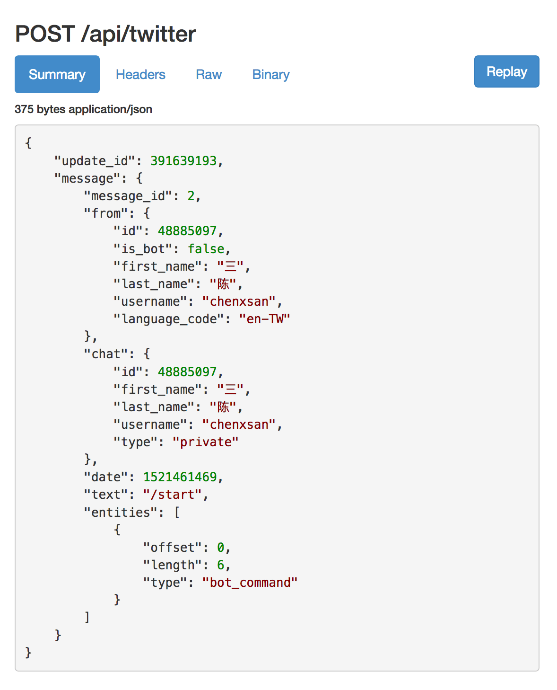

# 规划

我初步设想的流程是这样：

1.  用户添加机器人，此时服务器收到客户端发来的 `/start` 消息，返回 twitter OAuth 授权链接
2.  用户点击 OAuth 授权链接登录他们的 twitter 账户并完成授权
3.  授权成功后，数据库中保存用户的 telegram id 及 twitter 的 access token
4.  用户发送消息给机器人
5.  服务器收到用户消息，根据用户 id 获取数据库中对应的 access token 然后提交消息给 twitter api
6.  服务器收到 twitter 响应，视情况决定是否给用户一个反馈

## 本地开发的问题

在本地开发 telegram 发推机器人会有一个问题：webhook 必须是线上可访问的。而在开发阶段，Phoenix 服务运行在本地，外网无法访问到。

我能想到的解决办法是，使用线上 webhook。webhook 收到 telegram 推送消息后转发给本地 Phoenix 开发服务器。

俩种方案：

1.  Reverse ssh tunnel - 这个稳定性很差，墙内经常断，需要重连，严重影响开发体验
2.  [ngrok](https://github.com/inconshreveable/ngrok) - 这个虽然被墙，但墙不是问题，而且据我的使用体验，ngrok 十分稳定，另外它还有可视化界面，便于我们查看 http 请求与响应。当然，免费版的 ngrok 是有时限的，8 小时后就要重新创建。

权衡后，我选了 ngrok。

安装 ngrok，并执行命令：

```sh
$ /Applications/ngrok http 4000
ngrok by @inconshreveable                                                                                                                                       (Ctrl+C to quit)

Session Status                online
Session Expires               7 hours, 59 minutes
Version                       2.2.8
Region                        United States (us)
Web Interface                 http://127.0.0.1:4040
Forwarding                    http://fd80be0a.ngrok.io -> localhost:4000
Forwarding                    https://fd80be0a.ngrok.io -> localhost:4000

Connections                   ttl     opn     rt1     rt5     p50     p90
                              0       0       0.00    0.00    0.00    0.00
```

ngrok 将会在本地 4000 端口与 ngrok 的随机公开网址间形成映射。

接着访问下列网址，将 webhook 设置为 ngrok 随机生成的地址 `https://fd80be0a.ngrok.io`（注意必须是 https 网址）：

> `https://api.telegram.org/bot(token-here)/setwebhook?url=https://fd80be0a.ngrok.io/api/twitter`

目前，我们的 `/api/twitter` 路由还没有创建。

之后本地开发服务器就能收到线上 webhook 转发来的 telegram 消息，如下图：


